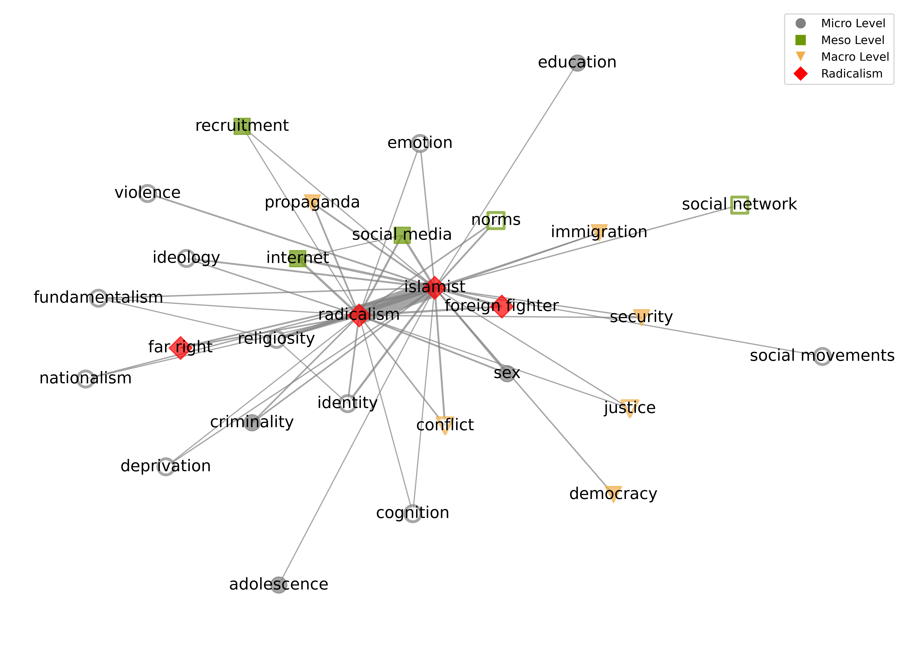
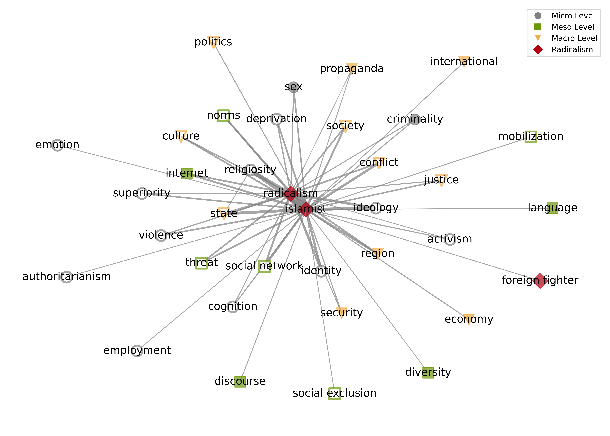
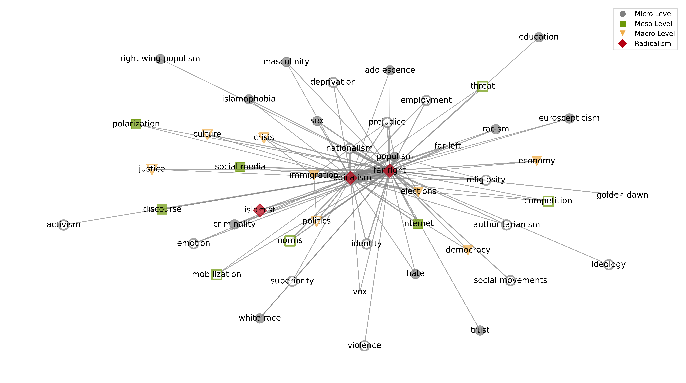
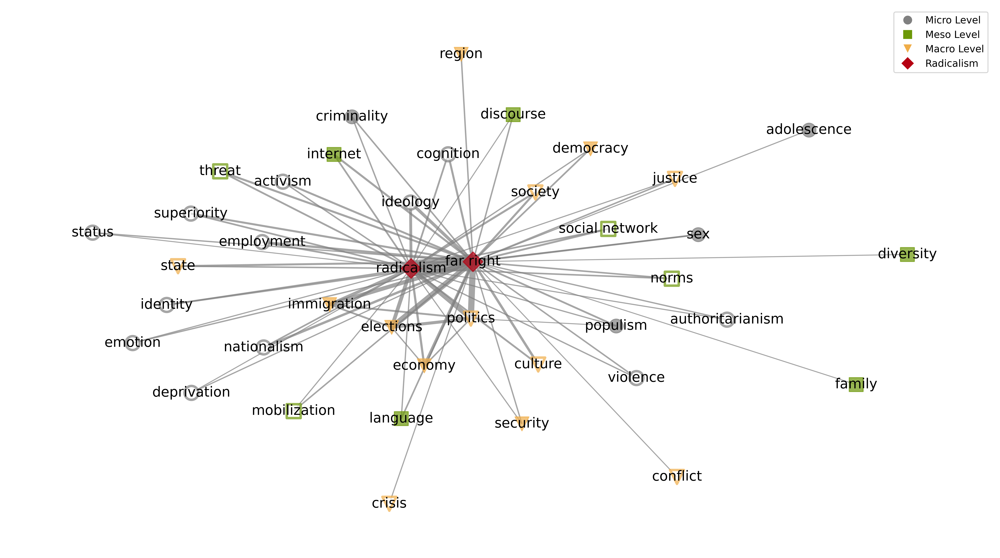
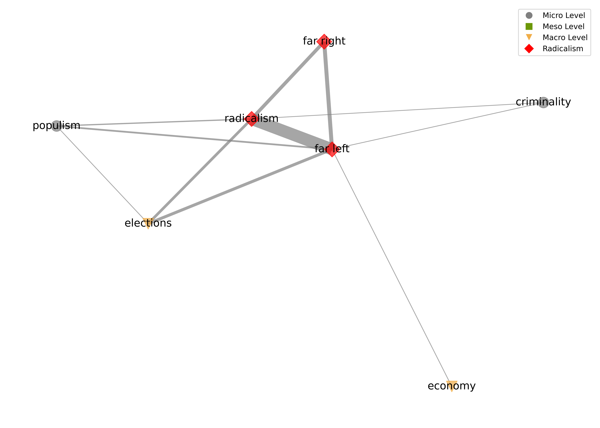
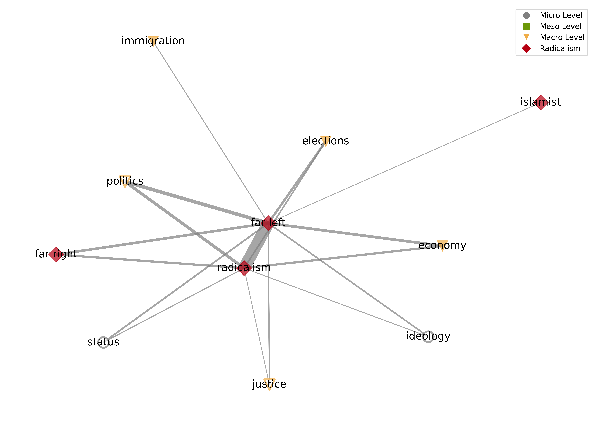
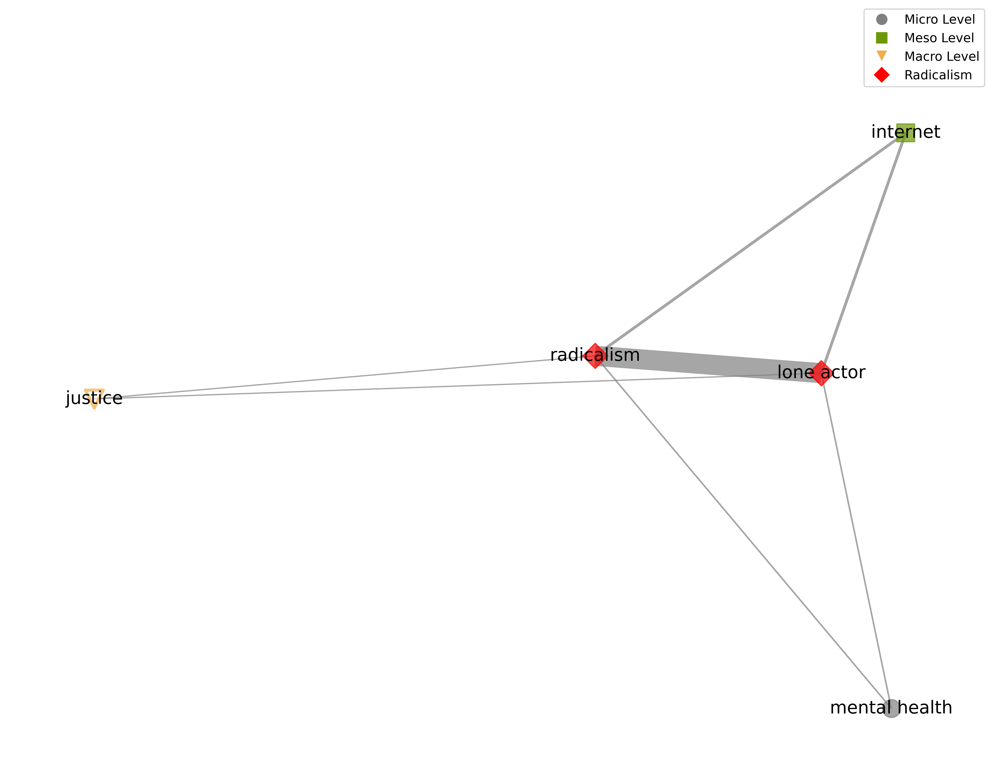
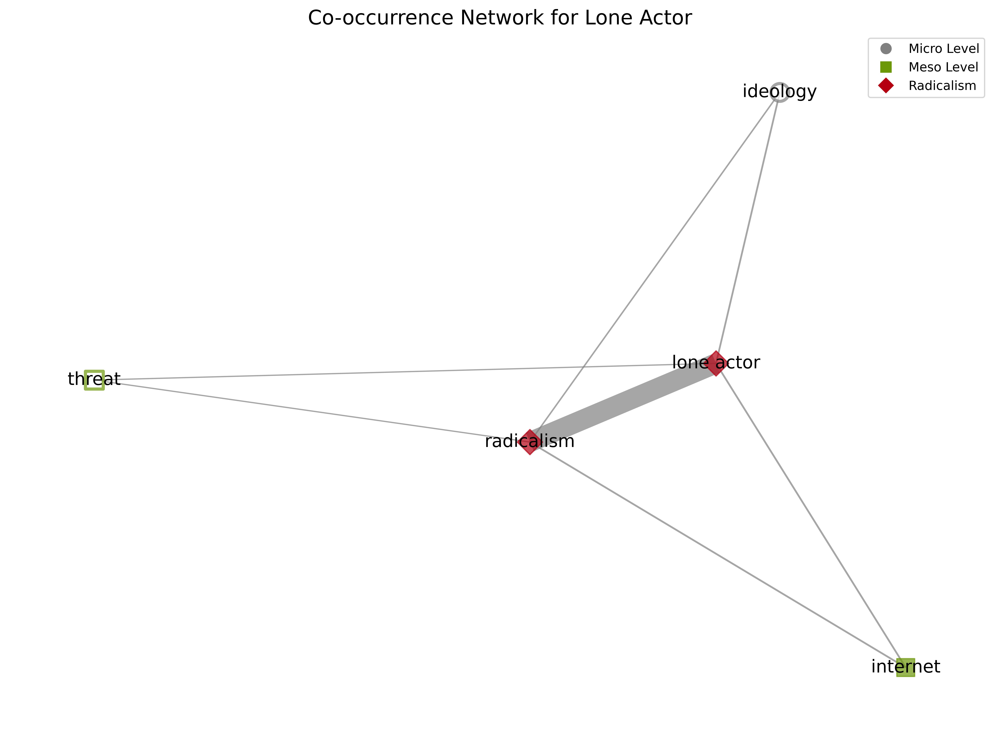
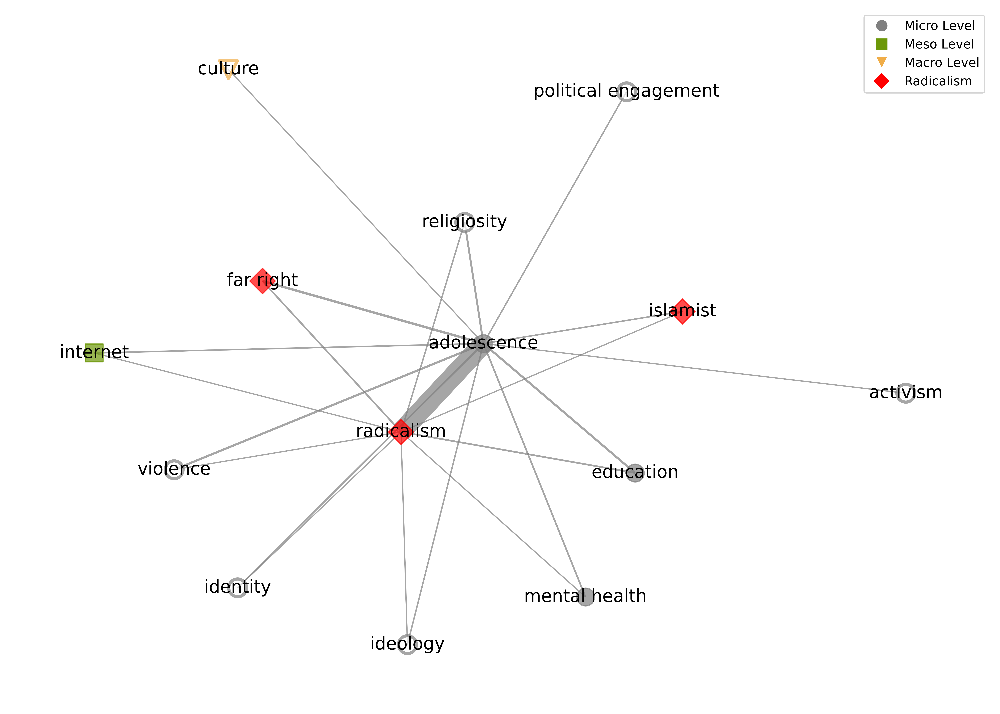
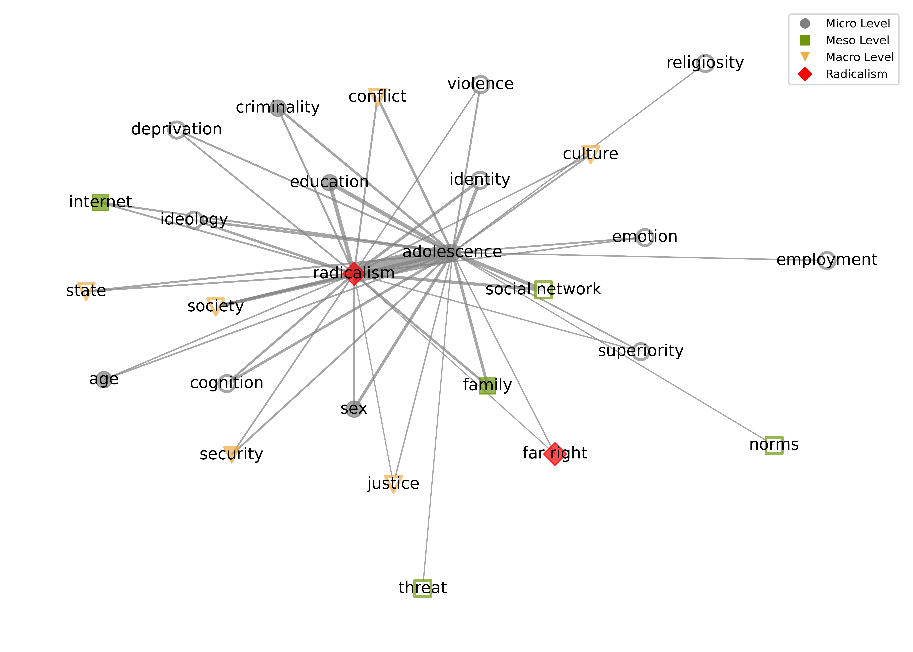

# Co-occurrence Maps

Author: ANONYMOUS 7/22/2024

## Supplementary Analysis: Co-occurrence Maps of Keyword and Abstract Corpora

In the main manuscript we provided a selection of co-occurrence maps (a general map of the keyword corpus, a general map of the abstract corpus, and maps for specific terms (i.e., islamist, far right and far left) of the abstract corpus only.

We here present all specific maps of both the keyword and the abstract corpus.

### 1. Islamist

#### 1.1 Analysis 1: Keywords

Figure 1.1:Co-occurrence map for "islamist" in Analysis 1.

#### 1.2 Analysis 2: Abstracts

Figure 1.2: Co-occurrence map for "islamist" in Analysis 2.

### 2. Far right

#### 2.1 Analysis 1: Keywords

Figure 2.1: Co-occurrence map for "far right" in Analysis 1.

#### 2.2 Analysis 2: Abstracts

Figure 2.2: Co-occurrence map for "far right" in Analysis 2.

### 3. Far left

#### 3.1 Analysis 1: Keywords

Figure 3.1: Co-occurrence map for "far left" in Analysis 1.

#### 3.2 Analysis 2: Abstracts

Figure 3.2: Co-occurrence map for "far left" in Analysis 2.

### 4. Lone actor

#### 4.1 Analysis 1: Keywords

Figure 4.1: Co-occurrence map for "lone actor" in Analysis 1.

#### 4.2 Analysis 2: Abstracts

Figure 4.2: Co-occurrence map for "lone actor" in Analysis 2.

### 5. Foreign Fighter

#### 5.1 Analysis 1: Keywords

#### 5.2 Analysis 2: Abstracts

### 6. Male Supremacist

#### 6.1 Analysis 1: Keywords

#### 6.2 Analysis 2: Abstracts

### 7. Adolescence

#### 7.1 Analysis 1: Keywords

Figure 7.1: Co-occurrence map for "adolescence" in Analysis 1.

#### 7.2 Analysis 2: Abstracts

Figure 7.2: Co-occurrence map for "adolescence" in Analysis 2.

