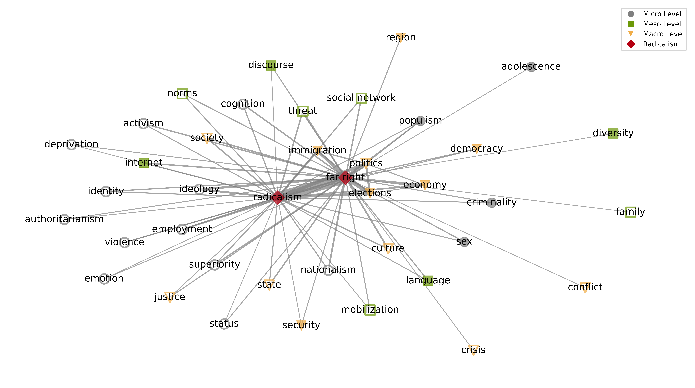
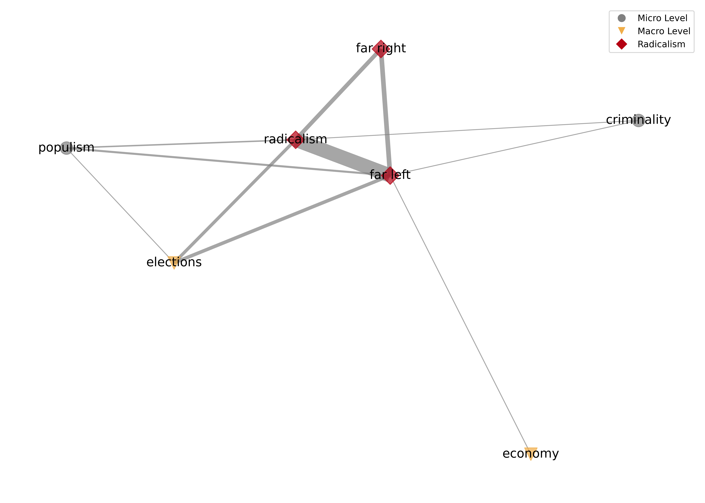
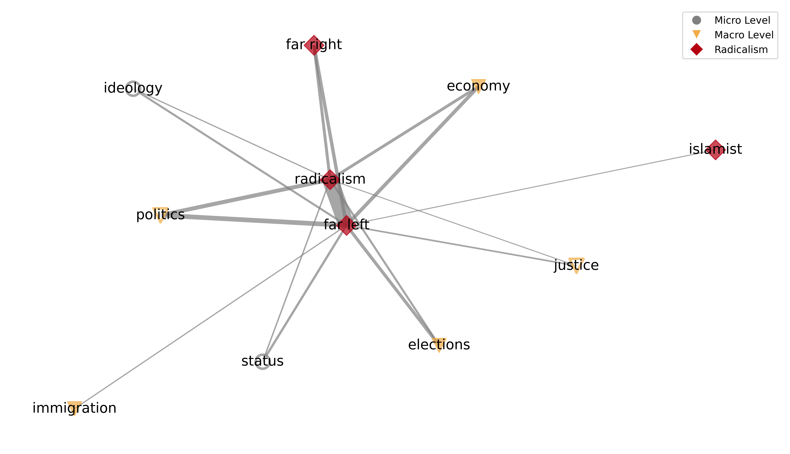
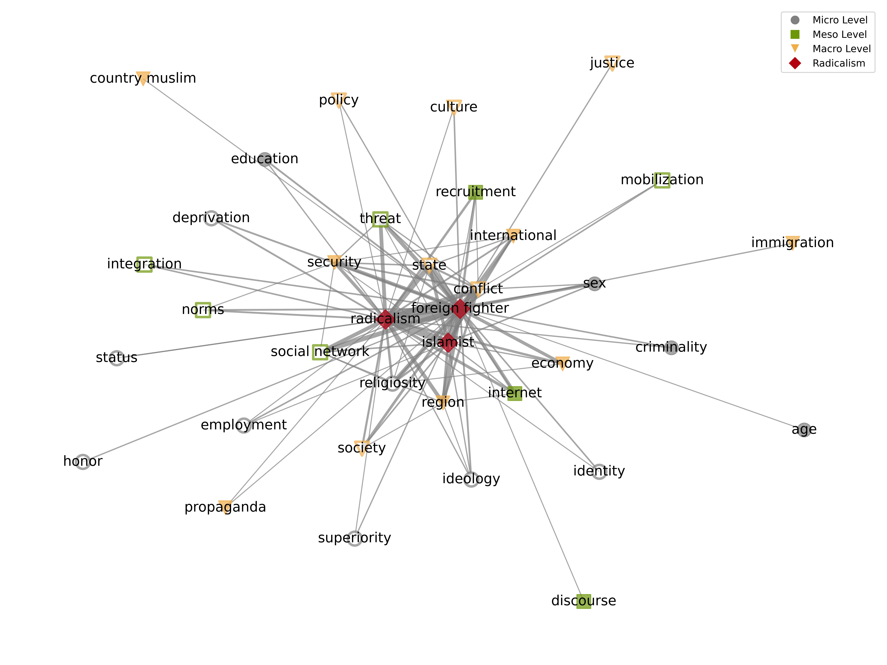
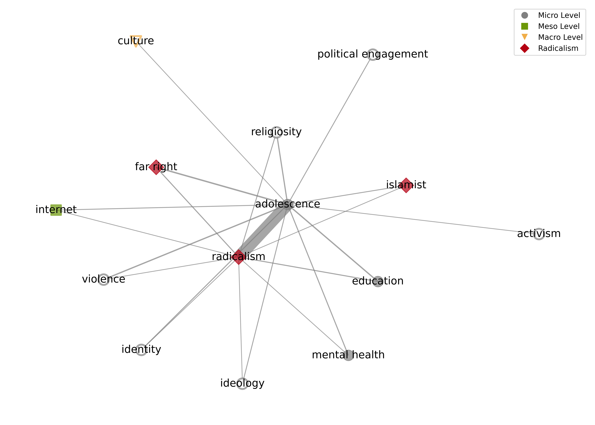

# Co-occurrence Maps

Author: ANONYMOUS 7/22/2024

## Supplementary Analysis: Co-occurrence Maps of Keyword and Abstract Corpora
 

In the main manuscript, we provided a selection of co-occurrence maps (i.e., a general map of the keyword corpus and a general map of the abstract corpus). We further presented maps for specific terms (i.e., "Islamist", "far right," and "far left") derived from the abstract corpus only. 
 
In this supplementary material, we present all specific co-occurrence maps generated from both the keyword corpus and the abstract corpus. 
 
Recognizing the critical importance of the adolescent age group in the context of radicalization, we further provide detailed co-occurrence maps for the term "adolescence" to shed light on the key concepts and associations related to this key demographic.

### 1. Islamist

#### 1.1 Analysis 1: Keywords

Figure 1.1: Co-occurrence map for "islamist" in Analysis 1.

 

#### 1.2 Analysis 2: Abstracts

Figure 1.2: Co-occurrence map for "islamist" in Analysis 2.

 

### 2. Far right

#### 2.1 Analysis 1: Keywords

Figure 2.1: Co-occurrence map for "far right" in Analysis 1.

 

#### 2.2 Analysis 2: Abstracts

Figure 2.2: Co-occurrence map for "far right" in Analysis 2.

 

### 3. Far left

#### 3.1 Analysis 1: Keywords

Figure 3.1: Co-occurrence map for "far left" in Analysis 1.

 

#### 3.2 Analysis 2: Abstracts

Figure 3.2: Co-occurrence map for "far left" in Analysis 2.

 

### 4. Lone actor

#### 4.1 Analysis 1: Keywords

Figure 4.1: Co-occurrence map for "lone actor" in Analysis 1.

 

#### 4.2 Analysis 2: Abstracts

Figure 4.2: Co-occurrence map for "lone actor" in Analysis 2.

 

### 5. Foreign Fighter

#### 5.1 Analysis 1: Keywords

Figure 5.1: Co-occurrence map for "foreign fighter" in Analysis 1.

 

#### 5.2 Analysis 2: Abstracts

Figure 5.2: Co-occurrence map for "foreign fighter" in Analysis 2.

 

### 6. Male Supremacist

#### 6.1 Analysis 1: Keywords

Figure 6.1: Co-occurrence map for "male supremacist" in Analysis 1.

 

#### 6.2 Analysis 2: Abstracts

Figure 5.2: Co-occurrence map for "male supremacist" in Analysis 2.

 

### 7. Adolescence

#### 7.1 Analysis 1: Keywords

Figure 7.1: Co-occurrence map for "adolescence" in Analysis 1.

 

#### 7.2 Analysis 2: Abstracts

Figure 7.2: Co-occurrence map for "adolescence" in Analysis 2.

 