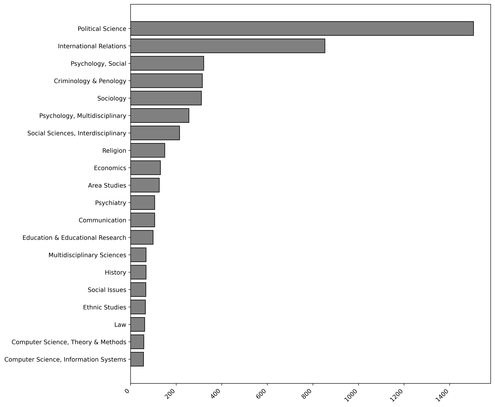
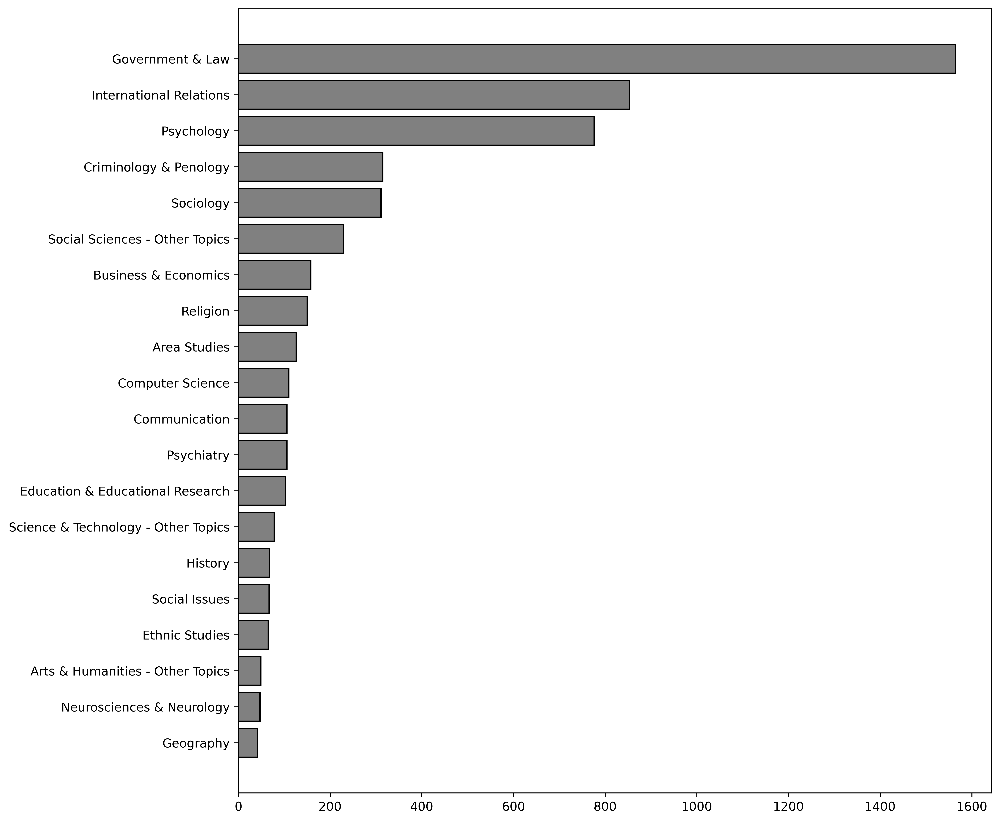

# Disciplines

Author: ANONYMOUS 7/22/2024

## Supplementary Analysis: Disciplines Included in the Corpus
 

To assess which disciplines were synthesized in the TMSR, we here present the frequencies of categories the included journals pertain to.
Below, we present frequencies of both Web of Science categories and research areas as indicated in the original export from Web of Science.
 
 
For comprehensive lists see the file "RTMR_Output."

Figure 1: Frequencies of web of science categories recurring in the corpus.

 

Figure 2: Frequencies of research areas recurring in the corpus.

