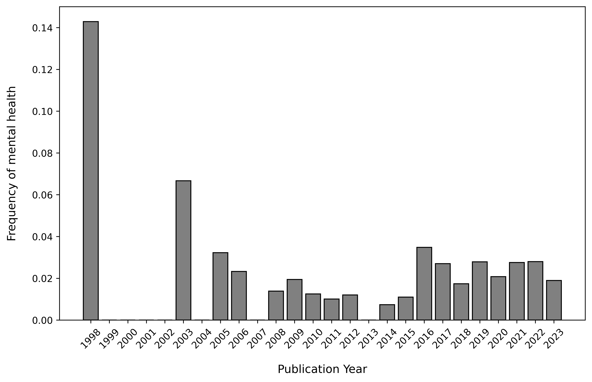
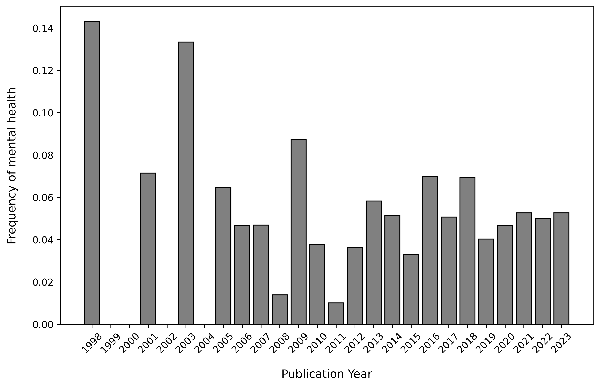

# Temporal Trends in the Occurrence of 'Mental Health'

Author: ANONYMOUS 7/22/2024

## Supplementary Analysis: Temporal Trends in the Occurrence of 'Mental Health' in Radicalization Research Articles
 

Given that many scholars advocating radicalization theories suggest moving away from psychopathological factors, we examined the frequency of mental health-related terms in publications over time. Our analysis confirms an overall decreasing trend. Below, we present the frequency of the term 'mental health' in both the keyword and abstract corpora.
 

To analyze the occurrence of 'mental health' in radicalization research articles, we calculated the raw frequency of the term for each year. The frequencies were then weighted by dividing the raw frequency of the term by the total number of articles published in that year, normalizing the frequency to account for the varying number of publications each year.

 
 

#### Analysis 1

Figure 1: Occurrence of 'Mental Health' in Author Keywords across Time.

 

#### Analysis 2

Figure 2: Occurrence of 'Mental Health' in Abstracts across Time.

 
 

Researchers frequently assert that terrorist actions can be committed by anyone, highlighting environmental factors rather than a narrow psychopathological diagnosis. This view, however, may be outdated due to its categorical approach to psychopathology. With the advent of the ICD-11 (World Health Organization, 2019) and the understanding of mental health on a spectrum, there is an opportunity to revitalize radicalization studies, particularly by examining how mental health intersects with meso- and macro-level influences.
 
 

# References

World Health Organization. (2019). International classification of diseases for mortality and morbidity statistics (11th Revision). https://icd.who.int/

