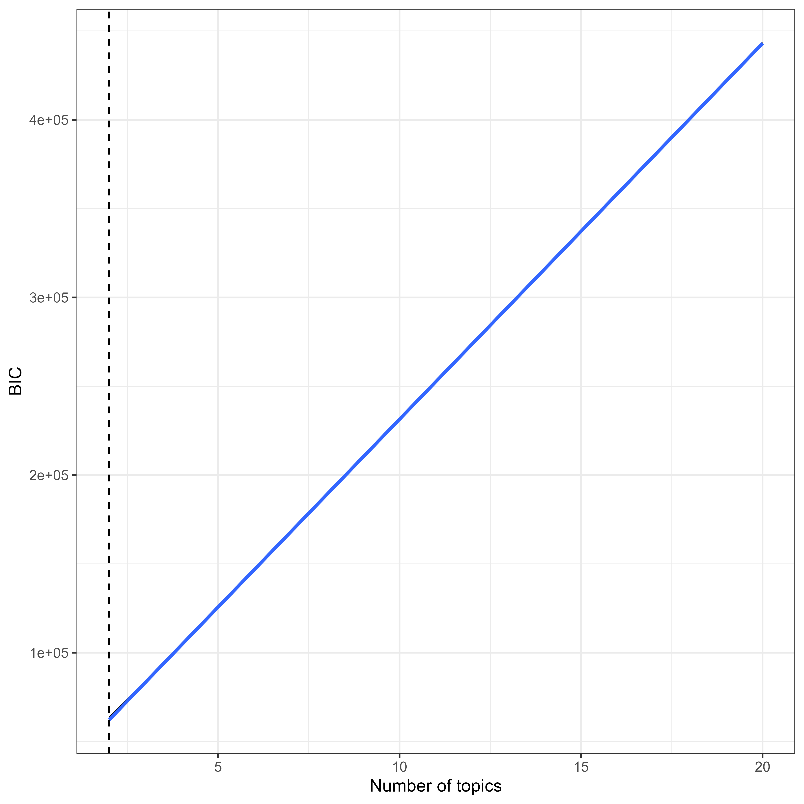
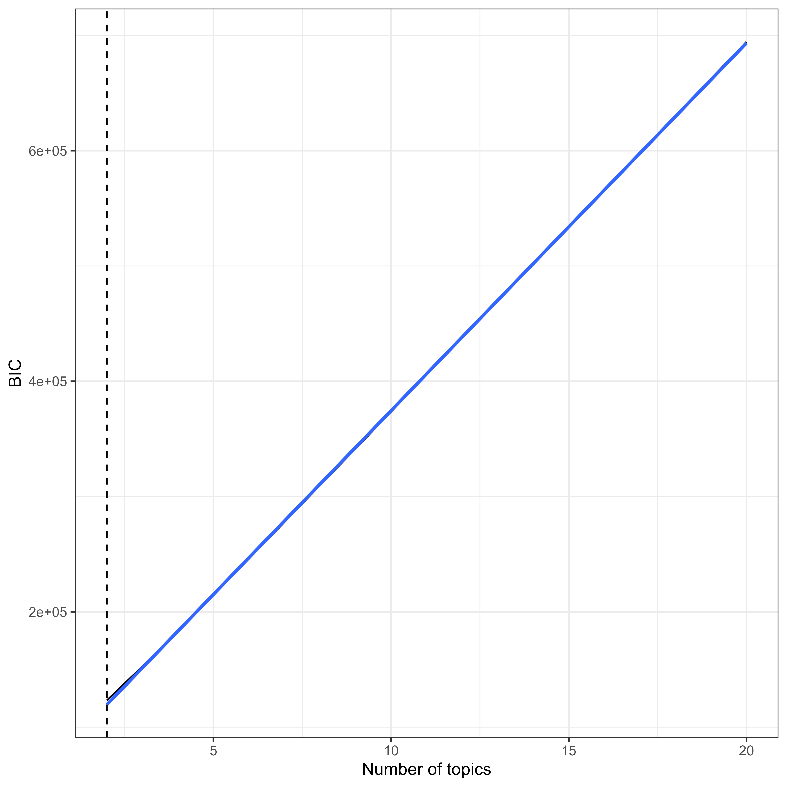
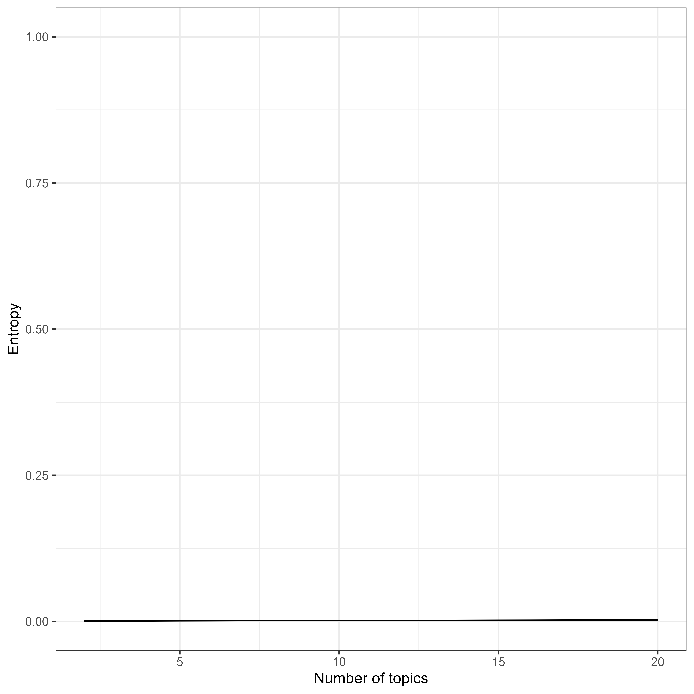

# Topic Models

Author: ANONYMOUS 7/21/2024

## Supplementary Analysis: Subcorpora Detection

### Analysis 1: Keywords

To detect whether the corpus consists of subcorpora (e.g., political science vs. psychology texts), which require a separate anylsis, we conducted topic modeling using latent Dirichlet allocation (Blei et al., 2003).

The corpus for analysis 1 consisted of author-provided keywords that were extracted by document. We further applied an exclusion filter of methodological terms and non-substantive words and classified closely related terms into phenomena. The resulting corpus consisted of 3093 documents and 13469 keywords (3124 unique keywords).

Following van Lissa's (2022) approach, we used the term frequency/inverse document frequency (TF-IDF) to select terms used frequently in a document, but not used frequently in the corpus, which could therefore be more diagnostic of subgroup membership.

We explored a range of 2-20 topics, assessing model fit through the Bayesian Information Criterion (BIC) and interpretability via the entropy of the posterior document/topic probabilities. Figure 1 illustrates that BIC values exhibited a nearly perfect linear increase, with the simplest model yielding the lowest BIC. This suggests that the data did not contain any discernible subgroups or clusters.

Figure 1: Analysis 1: Bayesian Information Criteria (BIC) for LDA models with 2-20 clusters.

 

Similarly, Figure 2 shows that all entropies were close to zero. Entropy measures how distinct the identified clusters are. The low entropy values in this analysis suggest that the posterior document/topic probabilities were nearly uniform, implying no distinct subgroups were detected. Consequently, we proceeded with analyzing the entire dataset as a single unit.

Figure 2: Analysis 1: Entropy values for LDA models with 2-20 clusters.

 

### Analysis 2: Abstracts

For the second analysis, we used abstracts from the chosen articles. We employed part-of-speech tagging (POS-tagging) to determine each words grammatical role. Since our goal was to identify phenomnena, we retained only nouns and adjectives. Retaining these words generally enhance the interpretability of text-mining outcomes (cf. Martin & Johnson, 2015). We further lemmatized the retained words, ensuring that, for example, both "identities" and "identity" would be reduced to "identity."

To evaluate the corpus homogeneity, we performed topic modeling,selecting terms with a TF-IDF score above the median.
We examined a range of 2 to 20 topics, assessing fit using the BIC and interpretability through the entropy of the posterior document/topic probabilities. As shown in Figure 3, the BIC values followed a nearly perfect linear increase, and the simplest model had the lowest BIC, suggesting that no subcorpora were identifiable.

Figure 3: Analysis 2: Bayesian Information Criteria (BIC) for LDA models with 2-20 clusters.

 

Accordingly, all entropies were near zero, as shown in Figure 4. Entropy measures the separability of the extracted clusters. The low entropies observed in this analysis suggest that the posterior document/topic probabilities were uniformly distributed. Therefore, no distinct subcorpora were identifiable, leading us to proceed with an analysis of the entire sample.

Figure 4: Analysis 2: Bayesian Information Criteria (BIC) for LDA models with 2-20 clusters.

 

The BICs showed a linearly increasing trend, and the entropies were near zero. Consequently, no distinct subcorpora were identified, leading us to proceed with an analysis of the entire sample.

# References

Blei, David M., Andrew Y. Ng, and Michael I. Jordan. 2003. ???Latent Dirichlet Allocation.??? *Journal of Machine Learning Research* 3 (Jan): 993???1022. <http://www.jmlr.org/papers/v3/blei03a>.

Martin, Fiona, and Mark Johnson. 2015. ???More Ef???cient Topic Modelling Through a Noun Only Approach.??? In *Proceedings of Australasian Language Technology Association Workshop*, 111???15.

van Lissa, C. J. (2022). Mapping phenomena relevant to adolescent emotion regulation: A text-mining systematic review. Adolescent Research Review, 7(1), 127-139. https://doi.org/10.1007/s40894-021-00163-5

