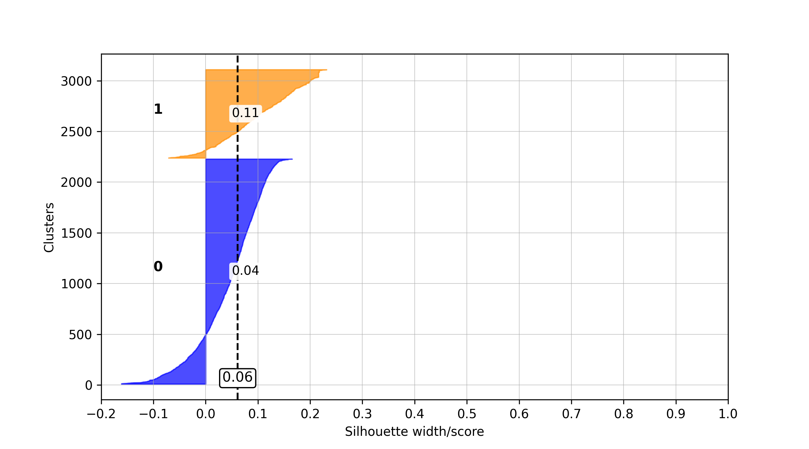
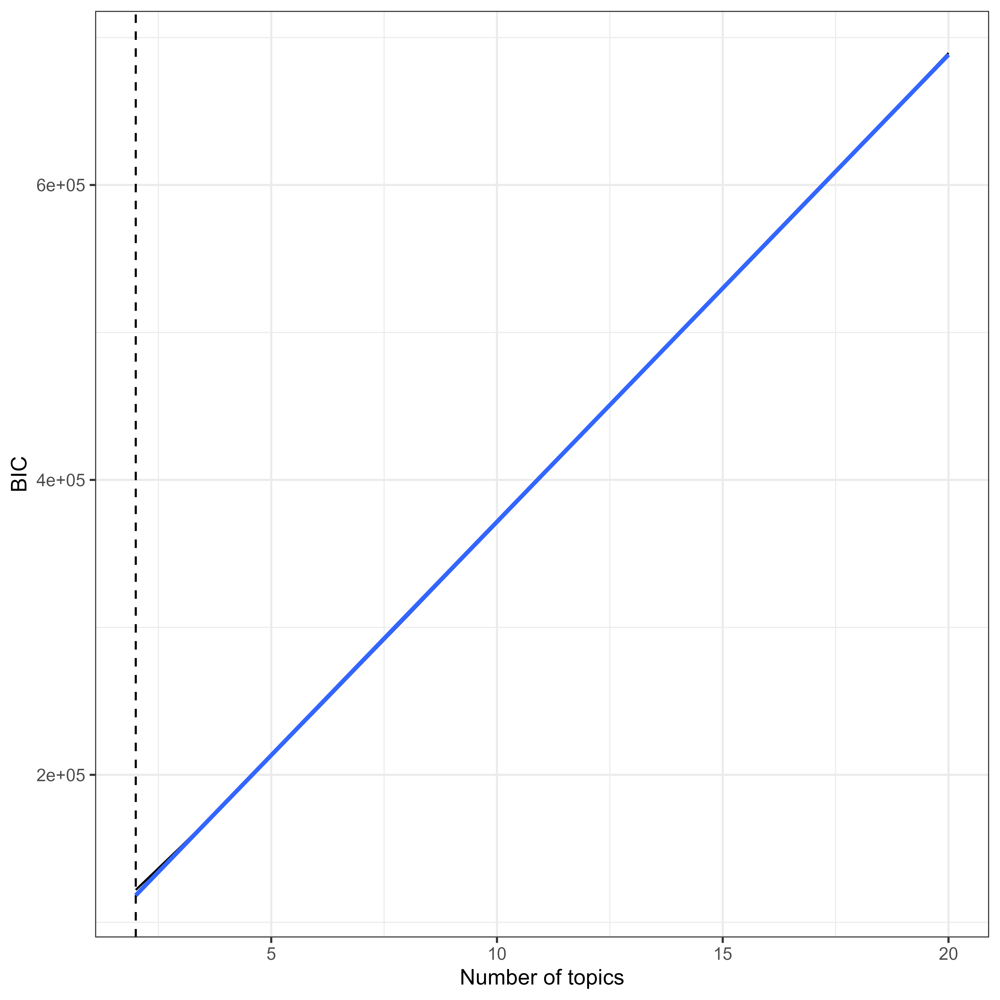

# Topic Models

Author: ANONYMOUS 7/21/2024

## Supplementary Analysis: Subcorpora Detection

To detect whether the corpus consists of subcorpora (e.g., political science vs. psychology texts), which require a separate anylsis, we conducted topic modeling using latent Dirichlet allocation (LDA; Blei et al.,2003).

The corpus for analysis 1 consisted of author-provided keywords that were extracted by document. We further applied an exclusion filter of
methodological terms and non-substantive words and classified closely related terms into phenomena. The resulting corpus consisted of 3093 documents and 13469 keywords (3124 unique keywords).

Following van Lissa's (2022) approach, we used the term frequency/inverse document frequency (TF-IDF) to select terms used frequently in a
document, but not used frequently in the corpus, which could therefore be more diagnostic of subgroup membership. We explored a range of 2-20 topics, assessing model fit through the Bayesian Information Criterion (BIC) and interpretability via the entropy of the posterior document/topic probabilities. Figure 1 illustrates that BIC values exhibited a nearly perfect linear increase, with the simplest model yielding the lowest BIC. This suggests that the data did not contain any discernible subgroups or clusters.

Figure 1: Bayesian Information Criteria (BIC) for LDA models with 2-20 clusters in Analysis 1.

 

Similarly, Figure 2 shows that all entropies were close to zero. Entropy measures how distinct the identified clusters are. The low entropy values in this analysis suggest that the posterior document/topic probabilities were nearly uniform, implying no distinct subgroups were detected. Consequently, we proceeded with analyzing the entire dataset as a single unit.

Figure 2: Entropy values for LDA models with 2-20 clusters in Analysis 1.

 

However, an LDA-based modelling approach is typically not suitable for a small number of structured tokens, as it is the case for author keywords. Thus, we additionally performed emebdding-based clustering to test for homogeneity of the keywords corpus. To this end, the keywords of each document were passed as a single text to SciBERT (Beltagy et al., 2019) whcih than extracted contextualised embedding vectors for each document. Subsequently, an agglomarative cluster analysis was performed. Similarly to the pre-registered LDA-based topic modelling approach, we explored 2-20 clusters, while assessing the fit using the average silhouette width for the entire data set (Rousseeuw, 1987).

Silhouette widht or scores range from -1 to 1, with -1 indicating a bad assignment of documents to clusters, 0 denoting a strong homogeinity of the instances (i.e., documents), and 1 indicating a high discriminatory power, and thus high heterogeniety, between the found clusters. Furthermore, an average silhouette width of .71-1.00 denotes a strong structure of heterogenous clsuters, .51-.70 reasonable, .26-.50 weak and potentially artificial, and < .26 no substantial structure, that is, homogenous data (Kaufman & Rousseuw, 1990, p. 88).

The average silhouette scores for the 2-20 clusters are displayed in <strong>Figure 3</strong>.

Figure 3: 

 

As the highest average silhouette value was achieved for the 2 clusters solution, silhouette values were further examined for both clusters individually (<strong>Figure 4</strong>). Eventually, all silhouette scores were close to 0 and < .26, indicating no strong structures of potential clusters and thus no potentially strong subcorpora.

Figure 4: 

 

## Analysis 2: Abstracts

For the second analysis, we used abstracts from the chosen articles. We employed part-of-speech tagging (POS-tagging) to determine the grammatical role of each word. Since our focus was on identifying phenomena, we kept only nouns and adjectives. Keeping these parts of speech enhances the interpretability of text mining models (Martin & Johnson, 2015). We then lemmatized the terms. This process yielded a corpus of 44687 keywords (2204 unique terms) across 4019 documents.
To evaluate the consistency of the abstract corpus, we performed topic modeling. We again tested topic ranges from 2-20, assessing fit with the Bayesian Information Criterion (BIC) and interpretability via the entropy of posterior document/topic probabilities. As shown in Figure 3, the BIC values increased almost linearly, and the simplest model had the lowest BIC. This indicated no identifiable subgroups within the corpus.

Figure 3: Bayesian Information Criteria (BIC) for LDA models with 2-20 clusters in Analysis 2.

 

Figure 4 shows that all entropies were close to zero, which indicates how distinct the extracted clusters are. The low entropy values suggest that the posterior document/topic probabilities were almost uniformly distributed, meaning no distinct subgroups were detected. As a result, we proceeded with analyzing the entire sample as a whole.

Figure 4: Bayesian Information Criteria (BIC) for LDA models with 2-20 clusters in Analysis 2.

 

The BICs showed a linearly increasing trend, and the entropies were near zero. Consequently, no distinct subcorpora were identified, leading us to proceed with an analysis of the entire sample.

# References

Beltagy, I., Lo, K., & Cohan, A. (2019). SciBERT: A pretrained language model for scientific text. *arXiv preprint*. 
https://doi.org/10.48550/arXiv.1903.10676

Blei, D. M., Ng, A. Y., & Jordan, M. I. (2003). Latent dirichlet allocation. *Journal of machine Learning research, 3*, 993-1022.

Martin, F., & Johnson, M. (2015, December). More efficient topic modelling through a noun only approach. *In Proceedings of the Australasian Language Technology Association Workshop 2015* (pp. 111-115).

Rousseeuw, P. J. (1987). Silhouettes: a graphical aid to the interpretation and validation of cluster analysis. *Journal of computational and applied mathematics, 20*, 53-65. https://doi.org/10.1016/0377-0427(87)90125-7

van Lissa, C. J. (2022). Mapping phenomena relevant to adolescent emotion regulation: A text-mining systematic review. *Adolescent Research Review, 7*(1), 127-139. https://doi.org/10.1007/s40894-021-00160-7