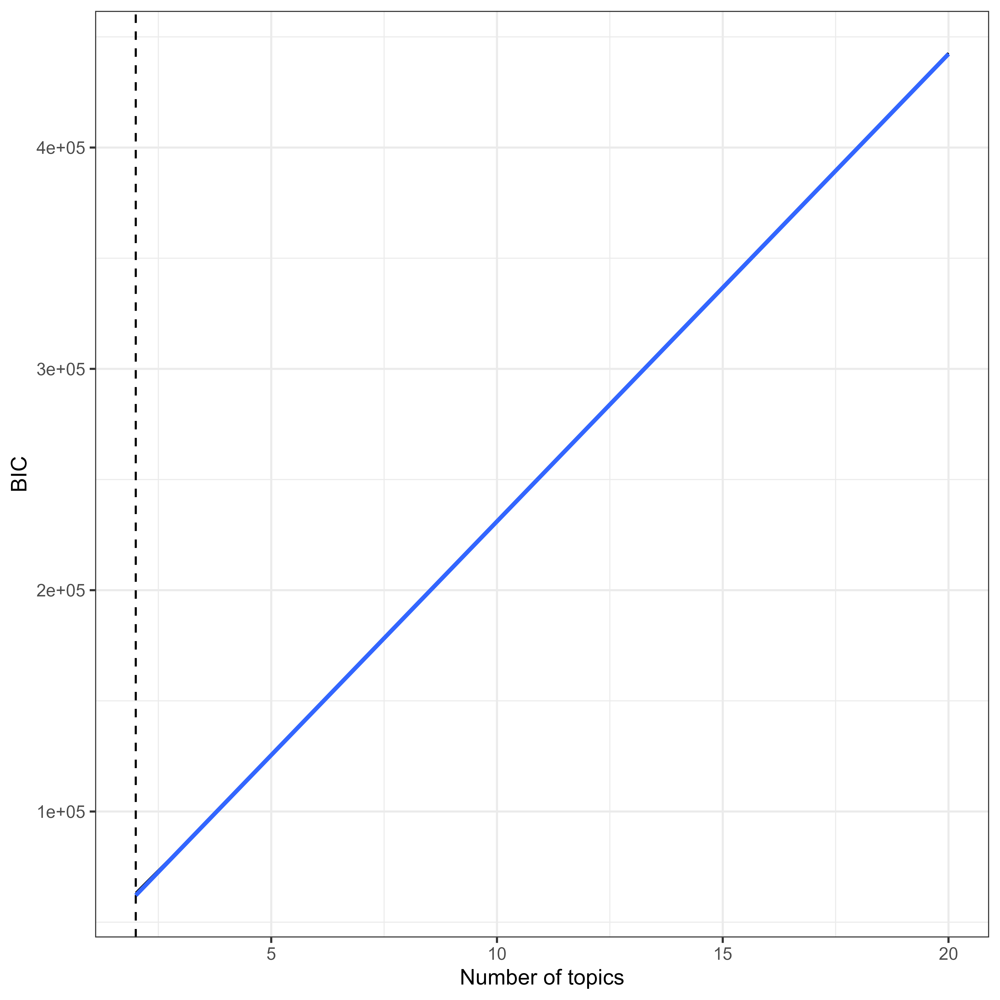

Topic Models
=================

Author: Anna Knorr
7/21/2024

## Supplementary Analysis: Subcorpora Detection

To detect whether the corpus consists of subscorpora (e.g., political science
vs. psychology texts), which require a separate anylsis, we conducted topic 
modeling using latent Dirichlet allocation (Blei et al., 2003). 

The corpus for analysis 1 consisted of author-provided keywords that were
extracted by document. We further applied an exclusion filter of 
methodological terms and non-substantive words. The resulting corpus 
consisted of 3093 documents and 5728 unique terms.

Following van Lissa's (2022)approach, we used the term frequency/inverse 
document frequency (TF-IDF) to select terms used frequently in a document, 
but not used frequently in the corpus, which could therefore be more 
diagnostic of subgroup membership. Selection terms with an TF-IDF greater 
than the median resulted in a corpus of 2304 documents and 3122 terms.

We considered a range from 2-20 topics, evaluating fit based on the BIC,
and interpretability based on the entropy of the posterior
document/topic probabilities. As can be seen in Figure
<a href="#fig:Keywords_BIC_study1">1</a>, the BICs followed a near-perfect linearly
increasing trend, and the simplest model had the lowest BIC, indicating
that no subcorpora could be identified.

Figure 1: Analysis 1: Bayesian Information Criteria (BIC) for LDA models
with 2-20 clusters.

Congruently, all entropies were near-zero, as seen in Figure
<a href="#fig:figent">2</a>. Entropy reflects the separability of the
extracted clusters. The low entropies observed in this analysis indicate
that the posterior document/topic probabilities were effectively
uniformly distributed. Thus, no subcorpora could be identified, and we
proceeded with an analysis of the whole sample.

Figure 2: Analysis 1: Entropy values for LDA models with 2-20 clusters.

